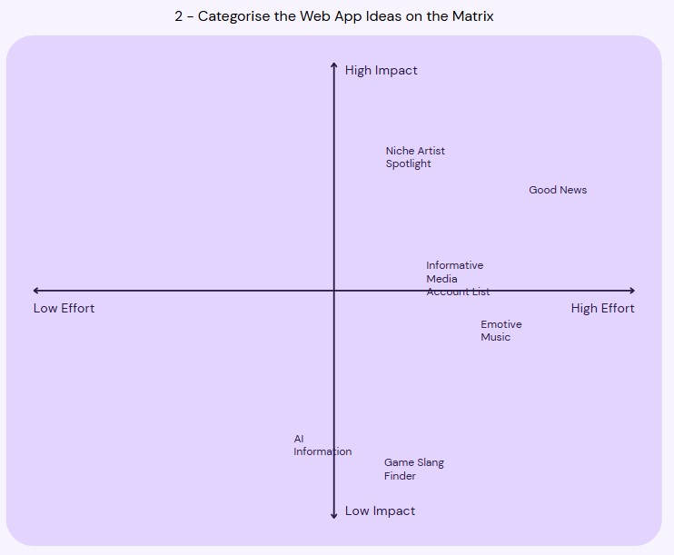

   
  
Reflection Paragraph  
From my Impact/Effort matrix, I was able to deduce that the small artist spotlight was (in my opinion) a very high impact idea that would require pretty average effort to create, in comparison to everything else. The peer swot analysis helped me realise the pros of the small artist spotlight, while also helping uncover some new weaknesses that I hadn’t thought about, while the good news analysis more or less came to the results that I expected, that it was good but would require a lot of time and effort to upkeep. Overall, I found that there was many pros and cons to each idea, however the idea that is the most realistic in my opinion, is the small artist spotlight.  
I have gone with the small artist spotlight