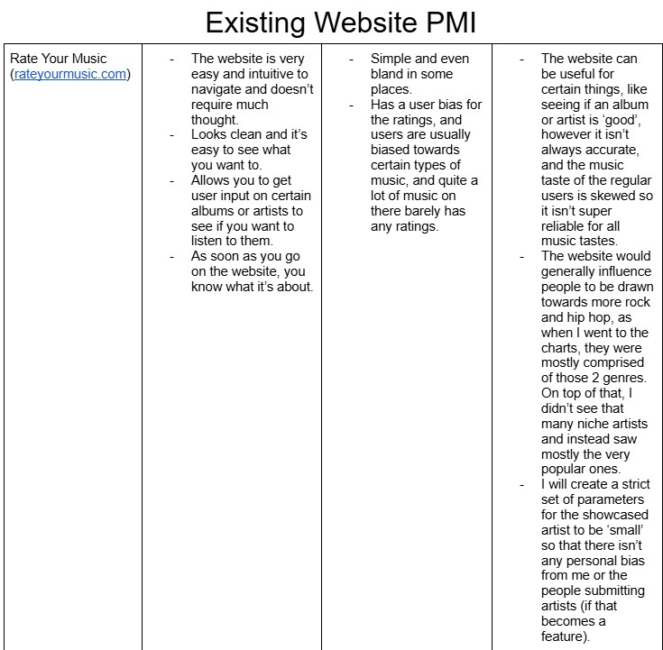
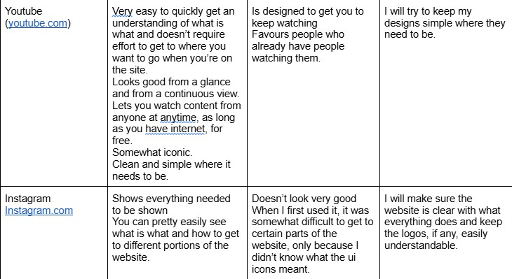
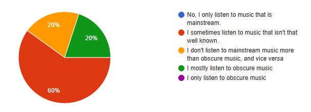
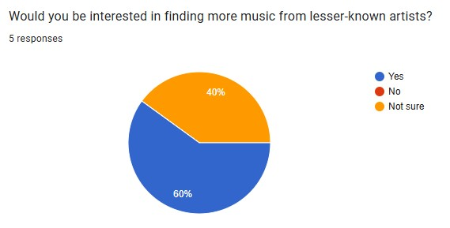
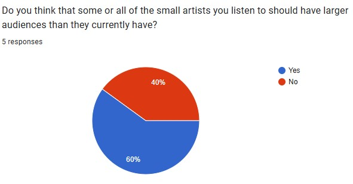
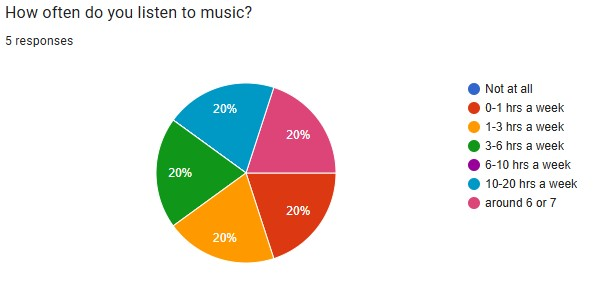

Existing Ideas  

  
Secondary Research  
  
Primary Research

  
Evaluation of Primary Research:  
From my primary research, I found that a lot of people who listen to more music are more prone to listen to less popular artists while everyone was either interested in finding more small artists to listen to or were unsure about it. The people who listened to more music were also more prone to say that the smaller artists deserve larger audiences and more recognition. The responders did sway slightly towards listening to more mainstream/pop, but the results were valid and gave insight nonetheless. This helped me be confident with my idea, and fit pretty well with my vision, so I didn't have to change much of anything.